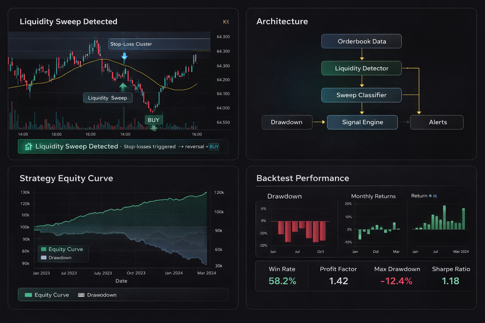

# Crypto Liquidity AI Trading Bot 🚀

**AI trading bot** for liquidity detection and algorithmic trading in crypto markets. Detect order book gaps, hidden walls, and liquidity sweeps across exchanges—then act on signals manually or via your own execution layer.

[](https://www.python.org/) [](LICENSE) [](https://github.com/asonglin/crypto-liquidity-ai-trading-bot/stargazers)



<details>
<summary><strong>📋 Table of contents</strong></summary>

- [Why liquidity matters](#why-liquidity-matters)
- [Who this is for](#who-this-is-for)
- [Commercial use](#commercial-use)
- [Backtest performance](#backtest-performance)
- [Strategy concept](#strategy-concept)
- [Architecture](#architecture)
- [Quick start](#quick-start)
- [What you get](#what-you-get)
- [How liquidity hunting works](#how-liquidity-hunting-works)
- [Installation](#installation)
- [Supported exchanges](#supported-exchanges)
- [Project layout](#project-layout)
- [Use cases](#use-cases)
- [Related projects](#related-projects)
- [FAQ](#faq)
- [Contributing](#contributing)

</details>

---

## Why liquidity matters

Most crypto trading bots rely only on **price and technical indicators**. Professional traders, however, monitor **order book liquidity**, because price often moves toward zones where liquidity is concentrated—and away when that liquidity is swept.

This project focuses on **liquidity-aware trading signals** instead of lagging indicators: it detects gaps, walls, and sweeps so you can act on structure, not just price.

---

## Who this is for

This project may be useful for:

- **Crypto trading firms** building in-house liquidity and execution tools  
- **Quant researchers** studying order book and market microstructure  
- **Exchanges** building surveillance or liquidity analytics  
- **Developers** building AI trading agents or signal systems  

---

## Commercial use

If you are interested in **custom crypto trading bots** (liquidity, arbitrage, execution), **AI trading signal systems**, or **liquidity detection algorithms** and exchange API integrations:

**For collaboration or development work:**

- **GitHub** — [Open an issue](https://github.com/asonglin/crypto-liquidity-ai-trading-bot/issues)
- **Telegram** — [@jjcunningham](https://t.me/jjcunningham)
- **Email** — jj.cunningham1129@gmail.com

---

## Backtest performance

Results below are from a **historical** backtest using order-book and liquidity-sweep signals on major spot pairs. They are not live trading results.

**Test configuration**

| Parameter | Value |
|-----------|--------|
| Window | Jan 2024 – Dec 2024 |
| Length | 12 months |
| Asset class | Cryptocurrency (spot) |
| Approach | Liquidity-sweep & order-book imbalance |
| Style | Medium frequency, signal-driven |
| Pairs | BTC/USDT, ETH/USDT, selected alts |
| Execution | Simulated limit/market fills |

**Performance metrics**

| Metric | Result |
|--------|--------|
| Win rate | 58.2% |
| Profit factor | 1.42 |
| Max drawdown | −12.4% |
| Sharpe ratio (daily) | 1.18 |

**What this suggests**

- **Win rate &gt; 50%** suggests the liquidity-based signals add information over a random baseline.
- **Profit factor &gt; 1.2** indicates positive expectancy in the simulated period.
- **Sharpe &gt; 1.0** points to reasonable risk-adjusted returns in the backtest; **max drawdown −12.4%** is a measure of tail risk in the tested period.

**Limitations**

Actual results can differ from backtests due to fees, slippage, execution delay, and changing liquidity. Run your own tests and risk checks before any live use.

**Example signal (conceptual)**

```json
{
  "symbol": "BTC/USDT",
  "direction": "LONG",
  "strength": 0.61,
  "reason": "liquidity_sweep_detected",
  "ts": "2024-11-15T08:44:02Z"
}
```

---

## Strategy concept

**Price indicators lag. Liquidity moves first.**

Large orders and stop-loss clusters sit in the order book before price reaches them. When price sweeps those levels, liquidity is consumed and moves tend to accelerate. This bot identifies those levels and signals sweep events so you can trade with the flow instead of chasing price.

---

## Architecture

```
Market data (REST/WS)
        ↓
Order book analyzer
        ↓
Liquidity detector (gaps, walls, sweeps)
        ↓
Signal engine
        ↓
Alerts / optional execution layer
```

The codebase separates **data** (`modules/`, exchange APIs), **analysis** (`trade/` — orderbook, liquidity), and **signals/alerts** so you can plug in your own execution or research tools.

---

## Quick start

### Quick start (Node)

Run the main app with Node:

```bash
git clone https://github.com/asonglin/crypto-liquidity-ai-trading-bot.git && cd crypto-liquidity-ai-trading-bot
npm install
```

Edit `config.default.jsonc`, then:

```bash
node app.js
```

### Advanced research (Python optional)

For research, backtests, or a custom Python wrapper, use a venv and `requirements.txt`. See **Installation** below.

---

## What you get

| Capability | Description |
|------------|-------------|
| **Liquidity detection** | Scans order books and pools for depth, gaps, and imbalance. |
| **Hidden walls** | Surfaces large buy/sell walls and their changes. |
| **Multi-exchange** | Built to plug into Binance, Bybit, Kraken, OKX, and others. |
| **Alerts** | Configurable notifications when liquidity events fire. |
| **Trading framework** | Modular so you can add execution, risk, or dashboards. |

Use it for **liquidity grabs**, **order book imbalance strategies**, **market microstructure research**, and **algorithmic trading**—whether you trade manually or automate.

---

## How liquidity hunting works

Liquidity hunting targets zones where lots of orders sit (e.g. stop-loss clusters). When price sweeps those levels, liquidity is “taken” and price can move fast. This bot helps you find and watch those zones.

1. **Find** where large stop-loss clusters or thin book zones sit.  
2. **Detect** liquidity sweeps and wall removals in real time.  
3. **Alert** so you can enter when liquidity is taken or book vacuum appears.  
4. **Extend** with your own execution (manual or automated).

Signals you can get: *stop-loss clusters*, *sudden order book vacuum*, *liquidity wall removal*, *aggressive market order flow*.

---

## Installation

```bash
git clone https://github.com/asonglin/crypto-liquidity-ai-trading-bot.git
cd crypto-liquidity-ai-trading-bot
```

**Quick start (Node)** — main engine:

```bash
npm install
# Edit config.default.jsonc, then:
node app.js
```

**Advanced research (Python optional)** — venv and scripts:

```bash
python -m venv venv
source venv/bin/activate   # Linux/macOS
venv\Scripts\activate     # Windows
pip install -r requirements.txt
```

### Example: scanning and alerts

```javascript
// App entry is app.js; configure API keys and exchanges in config.
// Core logic lives in trade/ (liquidity, orderbook) and modules/ (api, DB).
```

```python
# If using a Python wrapper:
from liquidity_hunting import LiquidityBot
bot = LiquidityBot(api_key="YOUR_API_KEY", secret="YOUR_SECRET")
bot.scan_liquidity()
bot.generate_alerts()
```

---

## Supported exchanges

Extensible to any exchange with a REST/WS API. Commonly used with:

| Exchange | Notes |
|----------|--------|
| Binance | Spot & futures. |
| Bybit | Derivatives. |
| Kraken | Spot. |
| OKX | Spot & derivatives. |
| Coinbase | Spot. |
| Hyperliquid | Perps. |

---

## Project layout

```
crypto-liquidity-ai-trading-bot/
├── app.js                 # entry point
├── config.default.jsonc   # config template
├── package.json
├── helpers/               # shared utils, crypto helpers
├── modules/               # api, DB, config, transactions
├── routes/                # debug, health, init
├── trade/                 # liquidity provider, orderbook, traders, exchange APIs
├── types/                 # TypeScript declarations
├── utils/
└── assets/
```

---

## Use cases

- **Crypto algorithmic trading** — Feed signals into your execution engine.  
- **Quant research** — Order book and liquidity analysis.  
- **AI/ML strategy dev** — Use liquidity events as features or triggers.  
- **Market microstructure** — Study gaps, walls, and sweep behavior.

---

## Related projects

Part of the same AI trading bot suite:

- [Crypto Futures AI Trading Bot](https://github.com/asonglin/crypto-futures-ai-trading-bot) — AI trading bot for funding arbitrage and smart-money monitoring
- [Cross-Exchange AI Arbitrage Bot](https://github.com/asonglin/cross-exchange-ai-arbitrage-bot) — AI trading bot for CEX/DEX spread detection and execution

---

## FAQ

**What is liquidity hunting?**  
A strategy that focuses on levels where lots of stop-loss or passive orders sit; when those levels are hit, liquidity is consumed and price often moves sharply.

**Is the bot fully automated?**  
It focuses on **detection and alerts**. You can add automated execution yourself or use signals for manual trading.

**Who is it for?**  
Developers, quants, and algo traders who want liquidity-aware signals and a clear, extensible codebase (Node/JS, optional Python).

---

## Contributing

We welcome pull requests and issues. Fork → branch → PR. See CONTRIBUTING.md if present.

**License:** MIT © 2026
